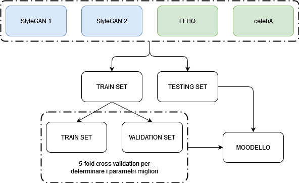
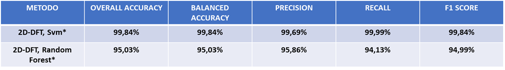

# Face-forgery-detection
Distinguish a real face from one created by a GAN

### Index

1. [**What is**](#what-is)
2. [**Dataset**](#Dataset)
3. [**Method**](#Method)
4. [**Evaluation and Results**](#evaluation-and-results)
5. [**Reference**](#Reference)
6. [**Credits**](#credits)

<ul>

<li>
	
## What is

Facial manipulation technologies have achieved significant advances (eg GAN…).
Social concerns about the potential abuse of these technologies have led to the emergence of a new research topic: face forgery detection.
However, it is extremely challenging as recent advances have been able to create faces beyond the perception capability of human eyes, especially in images and videos.
A possible approach to identifying fake faces is through spectrum analysis, as the frequency provides a complementary point of view through which falsification artifacts
or compression errors could be described well.
The method that was adopted to address the issue under consideration saw the use of the discrete Fourier transform applied to the images to move to the frequency domain, extracting interesting features for the subsequent classification of faces into real or false.
Two GAN networks have been adopted for the creation of the fake faces: StyleGAN and StyleGAN 2 both from Nvidia.
	
</li> 

<li>
	
## Dataset

<ul>
	
<li>Flickr-Faces-HQ (FFHQ) is a high-quality image dataset of human faces, originally created as a benchmark for opposing generative networks (GANs): the dataset consists of 70,000 high-quality PNG images with a resolution of 1024 × 1024 and contains notable variations in terms of age, ethnicity and background of the image. It also has good coverage of accessories such as eyeglasses, sunglasses, hats, etc. The images were scanned from Flickr and automatically aligned and cropped.</li>

<li>CelebFaces Attributes Dataset (CelebA) is a large-scale face attribute dataset with over 200,000 celebrity images, each with 40 attribute annotations. The images in this dataset cover large variations in pose and background confusion. CelebA has great diversity, large quantities and rich annotations. The version used is the high definition version with a resolution of 1024 x 1024.</li>

<li>StyleGAN1 100k generated images: dataset of 100,000 images produced using StyleGAN set to obtain the best quality of faces with a resolution of 1024x1024.</li>

<li>StyleGAN2 100k generated images: of 100,000 images produced using StyleGAN 2 set to obtain the best quality of faces with resolution 1024x1024.</li>

   

</ul>
	
</li>
	
<li>

## Method

Frequency domain analysis is important in signal processing theory. In the field of computer vision, the repetitive nature or characteristics of frequencies can be analyzed in space through the Fourier Transform. The information extracted is a spectral decomposition of the input and indicates how the signal energy is distributed over a range of frequencies.  

	
<b>2D Discrete Fourier Transform (2D DFT)</b>  
   
   

<b>Azimuthal Average</b> 
   
   
   
   

</li>

<li>

## Evaluation and Results

<b>1 vs 1</b>: this first experiment aims to discover significant patterns in order to discriminate real faces from fake ones as effectively as possible using a dataset of real faces and one of fake faces in rotation (1 vs 1). Therefore the tests performed concern: FFHQ vs StyleGAN 1, FFHQ vs StyleGAN 2, celebA vs StyleGAN 1 and celebA vs StyleGAN 2. For the subdivision into train set and test set, the proportion 80% - 20% was adopted respectively, so as to have the same number of samples of real and fake faces in both the train set and test set. In particular, the train set consists of 6400 samples (3200 real, 3200 fake) the test set of 1600 samples (800 real, 800 fake). To determine the best parameters to apply to SVM and Random Forest, a 5-fold cross validation was performed on the train set. The metric used to determine the best parameters was the fscore averaged over the test folds.

   

<b>FFHQ vs StyleGAN1</b>
   
   

<b>FFHQ vs StyleGAN2</b>
   
   
	
<b>CelebA vs StyleGAN1</b>
   
   
	
<b>CelebA vs StyleGAN2</b>
   
   
	
<b>Shallow learning (spectrum domain) vs Deep learning (pixel domain)</b>
   

<b>2 vs 1</b>: this experiment instead aims to compare with other related works [4] [5] [33] [34]. The approach on this occasion consists of a 2 vs 1, or two datasets of real faces and one of fake faces. Therefore the tests performed concern: FFHQ, celebA vs StyleGAN 1, FFHQ, celebA vs StyleGAN 2. For the subdivision into train set and test set, the proportion 80% - 20% stratified was adopted respectively so as to have the same number of samples of real and fake faces both in the train set and test set. In particular, the train set consists of 6400 samples (3200 real, 3200 fake) the test set of 1600 samples (800 real, 800 fake). To determine the best parameters to apply to SVM and Random Forest, a 5-fold cross validation was performed on the train set. The metric used to determine the best parameters was the fscore averaged over the test folds.

   

<b>FFHQ, CelebA vs StyleGAN1</b>
   

<b>FFHQ, CelebA vs StyleGAN2</b>
   

<b>My method vs State of the art</b>
   

<b>FFHQ, celebA vs StyleGAN 1, StyleGAN 2</b>: to conclude the experimentation, all the individual datasets were combined to form a single dataset from which to determine the discriminating patterns to correctly classify real faces from fake ones (fig. 22). For the subdivision into train set and test set, the 80% - 20% stratified proportion was adopted respectively so as to have the same number of samples of real and fake faces both in the train set and test set. In particular, the train set consists of 12800 samples (6400 real, 6400 fake) the test set of 3200 samples (1600 real, 1600 fake). To determine the best parameters to apply to SVM and Random Forest, a 5-fold cross validation was performed on the train set. The metric used to determine the best parameters was the fscore averaged over the test folds.

   
   

</li>

<li>

## Reference

[1] Frank, J., Eisenhofer, T., Schönherr, L., Fischer, A., Kolossa, D., & Holz, T. (2020, November). Leveraging frequency analysis for deep fake image recognition. In International Conference on Machine Learning (pp. 3247-3258). PMLR. 
[2] Du, C. X. T., Trung, H. T., Tam, P. M., Hung, N. Q. V., & Jo, J. (2020, December). Efficient-Frequency: a hybrid visual forensic framework for facial forgery detection. In 2020 IEEE Symposium Series on Computational Intelligence (SSCI) (pp. 707-712). IEEE. 
[3] Durall, R., Keuper, M., Pfreundt, F. J., & Keuper, J. (2019). Unmasking deepfakes with simple features. arXiv preprint arXiv:1911.00686. 
[4] Giudice, O., Guarnera, L., & Battiato, S. (2021). Fighting deepfakes by detecting GAN DCT anomalies. arXiv preprint arXiv:2101.09781. 
[5] Zhang, X., Karaman, S., & Chang, S. F. (2019, December). Detecting and simulating artifacts in gan fake images. In 2019 IEEE International Workshop on Information Forensics and Security (WIFS) (pp. 1-6). IEEE. 
[6] Bai, Y., Guo, Y., Wei, J., Lu, L., Wang, R., & Wang, Y. (2020, October). Fake Generated Painting Detection Via Frequency Analysis. In 2020 IEEE International Conference on Image Processing (ICIP) (pp. 1256-1260). IEEE. 
[7] Durall, R., Keuper, M., & Keuper, J. (2020). Watch your up-convolution: Cnn based generative deep neural networks are failing to reproduce spectral distributions. In Proceedings of the IEEE/CVF Conference on Computer Vision and Pattern Recognition (pp. 7890-7899). 
[8] Odena, A., Dumoulin, V., & Olah, C. (2016). Deconvolution and checkerboard artifacts. Distill, 1(10), e3. 
[9] Rapporto clusit 2020. https://clusit.it/wp-content/uploads/download/Rapporto-Clusit_2020_web_ottobre.pdf 
[10] Ajder, H., Patrini, G., Cavalli, F., & Cullen, L. (2019). The state of deepfakes: Landscape, threats, and impact. Amsterdam: Deeptrace. 
[11] Ian J. Goodfellow, Jean Pouget-Abadie, Mehdi Mirza, Bing Xu, David Warde-Farley, Sherjil Ozair, Aaron Courville, and Yoshua Bengio. 2014. Generative adversarial nets. In Proceedings of the 27th International Conference on Neural Information Processing Systems - Volume 2. MIT Press, Cambridge, MA, USA, 2672–2680. 
[12] Brundage, M., Avin, S., Clark, J., Toner, H., Eckersley, P., Garfinkel, B., ... & Amodei, D. (2018). The malicious use of artificial intelligence: Forecasting, prevention, and mitigation. arXiv preprint arXiv:1802.07228. 
[13] Karras, T., Laine, S., & Aila, T. (2019). A style-based generator architecture for generative adversarial networks. In Proceedings of the IEEE/CVF Conference on Computer Vision and Pattern Recognition (pp. 4401-4410). 
[14] Karras, T., Laine, S., Aittala, M., Hellsten, J., Lehtinen, J., & Aila, T. (2020). Analyzing and improving the image quality of stylegan. In Proceedings of the IEEE/CVF Conference on Computer Vision and Pattern Recognition (pp. 8110-8119). 
[15] Li, Y., Chang, M. C., & Lyu, S. (2018, December). In ictu oculi: Exposing ai created fake videos by detecting eye blinking. In 2018 IEEE International Workshop on Information Forensics and Security (WIFS) (pp. 1-7). IEEE. 
[16] Choi, Y., Choi, M., Kim, M., Ha, J. W., Kim, S., & Choo, J. (2018). Stargan: Unified generative adversarial networks for multi-domain image-to-image translation. In Proceedings of the IEEE conference on computer vision and pattern recognition (pp. 8789-8797). 
[17] Liu, Z., Luo, P., Wang, X., & Tang, X. (2015). Deep learning face attributes in the wild. In Proceedings of the IEEE international conference on computer vision (pp. 3730-3738). 
[18] Langner, O., Dotsch, R., Bijlstra, G., Wigboldus, D. H., Hawk, S. T., & Van Knippenberg, A. D. (2010). Presentation and validation of the Radboud Faces Database. Cognition and emotion, 24(8), 1377-1388. 
[19] He, Z., Zuo, W., Kan, M., Shan, S., & Chen, X. (2019). Attgan: Facial attribute editing by only changing what you want. IEEE Transactions on Image Processing, 28(11), 5464-5478. 
[20] Cho, W., Choi, S., Park, D. K., Shin, I., & Choo, J. (2019). Image-to-image translation via group-wise deep whitening-and-coloring transformation. In Proceedings of the IEEE/CVF Conference on Computer Vision and Pattern Recognition (pp. 10639-10647). 
[21] https://github.com/NVlabs/ffhq-dataset 
[22] Afchar, D., Nozick, V., Yamagishi, J., & Echizen, I. (2018, December). Mesonet: a compact facial video forgery detection network. In 2018 IEEE International Workshop on Information Forensics and Security (WIFS) (pp. 1-7). IEEE. 
[23] Yu, N., Davis, L. S., & Fritz, M. (2019). Attributing fake images to gans: Learning and analyzing gan fingerprints. In Proceedings of the IEEE/CVF International Conference on Computer Vision (pp. 7556-7566). 
[24] Szegedy, C., Ioffe, S., Vanhoucke, V., & Alemi, A. (2017, February). Inception-v4, inception-resnet and the impact of residual connections on learning. In Proceedings of the AAAI Conference on Artificial Intelligence (Vol. 31, No. 1). 
[25] Bentley, P. M., & McDonnell, J. T. E. (1994). Wavelet transforms: an introduction. Electronics & communication engineering journal, 6(4), 175-186. 
[26] Stuchi, J. A., Angeloni, M. A., Pereira, R. F., Boccato, L., Folego, G., Prado, P. V., & Attux, R. R. (2017, September). Improving image classification with frequency domain layers for feature extraction. In 2017 IEEE 27th International Workshop on Machine Learning for Signal Processing (MLSP) (pp. 1-6). IEEE. 
[27] Tan, M., & Le, Q. (2019, May). Efficientnet: Rethinking model scaling for convolutional neural networks. In International Conference on Machine Learning (pp. 6105-6114). PMLR. 
[28] He, K., Zhang, X., Ren, S., & Sun, J. (2016). Deep residual learning for image recognition. In Proceedings of the IEEE conference on computer vision and pattern recognition (pp. 770-778). 
[29] Qian, Y., Yin, G., Sheng, L., Chen, Z., & Shao, J. (2020, August). Thinking in frequency: Face forgery detection by mining frequency-aware clues. In European Conference on Computer Vision (pp. 86-103). Springer, Cham. 
[30] Odena, A., Dumoulin, V., & Olah, C. (2016). Deconvolution and checkerboard artifacts. Distill, 1(10), e3. 
[31] Boser, B. E., Guyon, I. M., & Vapnik, V. N. (1992, July). A training algorithm for optimal margin classifiers. In Proceedings of the fifth annual workshop on Computational learning theory (pp. 144-152). 
[32] Breiman, L. (2001). Random forests. Machine learning, 45(1), 5-32. 
[33] Wang, R., Ma, L., Juefei-Xu, F., Xie, X., Wang, J., & Liu, Y. (2019). Fakespotter: A simple baseline for spotting ai-synthesized fake faces. arXiv preprint arXiv:1909.06122, 2. 
[34] Guarnera, L., Giudice, O., & Battiato, S. (2020). Fighting Deepfake by Exposing the Convolutional Traces on Images. IEEE Access, 8, 165085-165098. 
	
</li>
	
<li>

### Credits

**Developed and Designed by:**

[**mpia3**](https://github.com/mpia3)

</li>

</ul>
