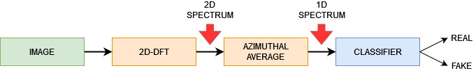

# Face-forgery-detection
Distinguish a real face from one created by a GAN

### Index

1. [**What is**](#what-is)
2. [**Dataset**](#Dataset)
3. [**Method**](#Method)
4. [**Evaluation and Results**](#evaluation-and-results)
5. [**Credits**](#credits)

<ul>

<li>
	
## What is

Facial manipulation technologies have achieved significant advances (eg GAN…).
Social concerns about the potential abuse of these technologies have led to the emergence of a new research topic: face forgery detection.
However, it is extremely challenging as recent advances have been able to create faces beyond the perception capability of human eyes, especially in images and videos.
A possible approach to identifying fake faces is through spectrum analysis, as the frequency provides a complementary point of view through which falsification artifacts
or compression errors could be described well.
The method that was adopted to address the issue under consideration saw the use of the discrete Fourier transform applied to the images to move to the frequency domain, extracting interesting features for the subsequent classification of faces into real or false.
Two GAN networks have been adopted for the creation of the fake faces: StyleGAN and StyleGAN 2 both from Nvidia.
	
</li> 

<li>
	
## Dataset

<ul>
	
<li>Flickr-Faces-HQ (FFHQ) is a high-quality image dataset of human faces, originally created as a benchmark for opposing generative networks (GANs): the dataset consists of 70,000 high-quality PNG images with a resolution of 1024 × 1024 and contains notable variations in terms of age, ethnicity and background of the image. It also has good coverage of accessories such as eyeglasses, sunglasses, hats, etc. The images were scanned from Flickr and automatically aligned and cropped.</li>

<li>CelebFaces Attributes Dataset (CelebA) is a large-scale face attribute dataset with over 200,000 celebrity images, each with 40 attribute annotations. The images in this dataset cover large variations in pose and background confusion. CelebA has great diversity, large quantities and rich annotations. The version used is the high definition version with a resolution of 1024 x 1024.</li>

<li>StyleGAN1 100k generated images: dataset of 100,000 images produced using StyleGAN set to obtain the best quality of faces with a resolution of 1024x1024.</li>

<li>StyleGAN2 100k generated images [14]: of 100,000 images produced using StyleGAN 2 set to obtain the best quality of faces with resolution 1024x1024.</li>

</ul>
	
</li>
	
<li>

## Method

Frequency domain analysis is important in signal processing theory. In the field of computer vision, the repetitive nature or characteristics of frequencies can be analyzed in space through the Fourier Transform. The information extracted is a spectral decomposition of the input and indicates how the signal energy is distributed over a range of frequencies.

</li>

<li>

## Evaluation and Results

</li>

<li>
	
### Credits

**Developed and Designed by:**

[**mpia3**](https://github.com/mpia3)

</li>

</ul>
